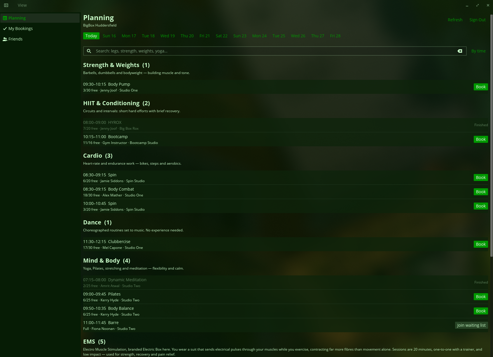

# BigBox for COSMIC

A [COSMIC][cosmic] desktop app for booking classes at [BigBox Leisure Club][bigbox], built on the
same Resamania member API that powers the club's web app.



## Features

**Planning.** The club's timetable for any of the next 14 days. Classes are grouped into curated
categories by default — Strength & Weights, HIIT & Conditioning, Mind & Body, Reformer, EMS and so
on — each with a one-line explainer, because "EMS" and "Reformer" tell you nothing useful about what
you'd actually be doing. Toggle to **By time** for a flat chronological list instead.

**Search by what you want from a session**, not just the class name: `legs`, `strength`, `weights`,
`core`, `beginner`, `low-impact`. Every class carries hand-written tags, so `legs` finds Body Pump
and Spin as well as Legs, Bums and Tums. Multi-word queries narrow rather than widen — `beginner
pilates` won't match Advanced Reformer.

**Booking and waiting lists.** Book and cancel in a click. Full classes with room on the waiting
list offer **Join waiting list**, and once you're on it the row shows your place in the queue. The
club auto-promotes, so you're moved up without doing anything if a spot frees.

**Friends.** Add a friend's BigBox login and their upcoming bookings show up as *Also going* against
the classes on the planning grid, so you can see what they're doing before you book.

Classes that have already started are dimmed and marked *Finished*, so the day still reads as a
whole without them looking bookable.

## Class categories

BigBox's API does expose its own `activity_groups`, but they're too coarse to browse by and wrong in
places — it files "Beginners Hyrox" under *Dance* and "Zumba Gold" under *Aqua*. So the categories
and tags live in [`src/categories.rs`](./src/categories.rs), hand-curated from each class's own
description in the API and covering all 66 classes the club currently runs.

If the club adds a class that isn't in that table, it falls back to keyword matching on the name, so
new classes still land somewhere sensible rather than disappearing.

## The API client

[`src/api.rs`](./src/api.rs) is a standalone client for the Resamania member API and is usable
without the GUI. It's exposed as a library target, so:

```sh
export BIGBOX_EMAIL=you@example.com BIGBOX_PASSWORD=…
cargo run --example planning        # today's classes
cargo run --example planning -- 7   # the next 7 days
```

A few things about the API that shaped the client, and that are worth knowing before changing it:

- **Auth is an OAuth2 password grant** against `/{client_token}/oauth/v2/token`. Tokens last an hour
  and the refresh token rotates on every use, so there's nothing worth persisting between runs —
  the app stores your credentials and signs in again on launch.
- **Entities reference each other by IRI**, not id — a class names its activity as
  `"/bigbox/activities/2300"`. Turning those into names needs the lookup tables that `directory()`
  fetches.
- **Timestamps are naive** (`"2026-08-14T06:30:00"`, no offset) and are wall-clock times in the
  club's timezone. They're parsed as `NaiveDateTime` and deliberately not converted.
- **Joining a waiting list is the same request as booking.** The POST body is identical; the server
  returns `state: "queued"` instead of `"booked"` when the seats are gone.
- **`my_bookings()` returns your entire history**, including classes you attended months ago —
  those attendee records are never cleaned up. Use `bookings_from(date)` unless you want the
  history; it applies the date bound server-side.

## Installation

A [justfile](./justfile) is included by default for the [casey/just][just] command runner.

- `just` builds the application with the default `just build-release` recipe
- `just run` builds and runs the application
- `just install` installs the project into the system
- `just vendor` creates a vendored tarball
- `just build-vendored` compiles with vendored dependencies from that tarball
- `just check` runs clippy on the project to check for linter warnings
- `just check-json` can be used by IDEs that support LSP

## Translators

[Fluent][fluent] is used for localization of the software. Fluent's translation files are found in the [i18n directory](./i18n). New translations may copy the [English (en) localization](./i18n/en) of the project, rename `en` to the desired [ISO 639-1 language code][iso-codes], and then translations can be provided for each [message identifier][fluent-guide]. If no translation is necessary, the message may be omitted.

## Packaging

If packaging for a Linux distribution, vendor dependencies locally with the `vendor` rule, and build with the vendored sources using the `build-vendored` rule. When installing files, use the `rootdir` and `prefix` variables to change installation paths.

```sh
just vendor
just build-vendored
just rootdir=debian/bigbox-for-cosmic prefix=/usr install
```

It is recommended to build a source tarball with the vendored dependencies, which can typically be done by running `just vendor` on the host system before it enters the build environment.

## Developers

Developers should install [rustup][rustup] and configure their editor to use [rust-analyzer][rust-analyzer]. To improve compilation times, disable LTO in the release profile, install the [mold][mold] linker, and configure [sccache][sccache] for use with Rust. The [mold][mold] linker will only improve link times if LTO is disabled.

Run `cargo test` for the unit tests — they cover the category table, the search matching, and the
capacity and booking-state logic in the API client.

### A note on credentials

Your BigBox password, and those of any friends you add, are stored in plain text in the app's COSMIC
config directory (`~/.config/cosmic/io.orta.BigboxForCosmic/`). The API offers nothing better to
persist. Friends' accounts are full logins — BigBox has no concept of following another member, so
seeing what someone is going to means signing in as them with credentials they've given you.

[bigbox]: https://www.bigboxleisureclub.co.uk/
[cosmic]: https://system76.com/cosmic
[fluent]: https://projectfluent.org/
[fluent-guide]: https://projectfluent.org/fluent/guide/hello.html
[iso-codes]: https://en.wikipedia.org/wiki/List_of_ISO_639-1_codes
[just]: https://github.com/casey/just
[rustup]: https://rustup.rs/
[rust-analyzer]: https://rust-analyzer.github.io/
[mold]: https://github.com/rui314/mold
[sccache]: https://github.com/mozilla/sccache
